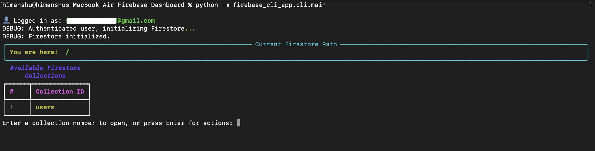
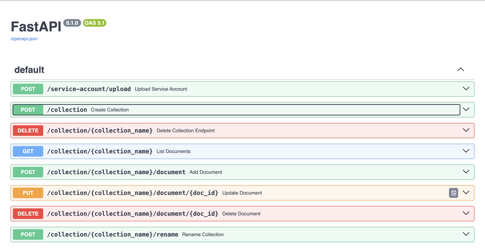

# FireDash

A modern, interactive CLI and dashboard for exploring, managing, and administering your Google Firestore database with ease.

## Features
- Browse Firestore collections, documents, and subcollections in a rich CLI interface
- View, add, edit, and delete documents and fields
- Rename collections and documents
- Intuitive navigation with minimal prompts and unified tables
- Supports multiple service account files (API)
- Clean, user-friendly menus and navigation

## Screenshots

### CLI Example


### API Example


## Installation

1. **Clone the repository:**
   ```sh
   git clone <your-repo-url>
   cd Firebase-Dashboard
   ```

2. **Set up a Python virtual environment (recommended):**
   ```sh
   python3 -m venv venv
   source venv/bin/activate
   ```

3. **Install dependencies:**
   ```sh
   pip install -r requirements.txt
   ```

4. **Prepare your credentials:**
   - Download your `client_secrets.json` (OAuth) and `serviceAccountKey.json` (Firebase Admin SDK) from the Google Cloud Console and Firebase Console.

## Usage

### CLI
Run the CLI tool from the project root:
```sh
python -m firebase_cli_app.cli.main
```

- Follow the prompts to authenticate and browse your Firestore database.
- Use numbers to select collections/documents, or press Enter for actions.
- Minimal, intuitive navigation with unified tables for fields and subcollections.

### API Server
You can also run the API server (see `firebase_cli_app/api/api_server.py`) to interact with Firestore via HTTP endpoints and support multiple service accounts.

## CLI Usage

The CLI provides an interactive way to explore and manage your Firestore database. To start the CLI:

```sh
python -m firebase_cli_app.cli.main
```

### Main Features
- Browse collections and documents
- Create, rename, and delete collections
- View, add, edit, and delete documents and fields
- Navigate using numbers for selection and alphabets for actions (A: Create, B: Rename, C: Delete, Q: Exit)
- Rich UI with tables and panels (no print-style output)

### Example Flow
1. Authenticate with your Google OAuth and Firebase Admin SDK credentials when prompted.
2. Select a collection by number to browse its documents.
3. Press Enter to access actions (create, rename, delete collections).
4. Use on-screen instructions for further navigation.

---

## API Endpoints

The API server (see `firebase_cli_app/api/api_server.py`) exposes HTTP endpoints for programmatic access to Firestore. Start the server with:

```sh
uvicorn firebase_cli_app.api.api_server:app --reload
```

### Main Endpoints

| Method | Endpoint                                      | Purpose                                  |
|--------|-----------------------------------------------|------------------------------------------|
| POST   | `/service-account/upload`                     | Upload a Firebase service account file    |
| POST   | `/collection`                                 | Create a new collection                  |
| DELETE | `/collection/{collection_name}`               | Delete a collection                      |
| POST   | `/collection/{collection_name}/document`      | Add a document to a collection           |
| PUT    | `/collection/{collection_name}/document/{id}` | Update a document                        |
| DELETE | `/collection/{collection_name}/document/{id}` | Delete a document                        |
| GET    | `/collection/{collection_name}`               | List all documents in a collection       |
| POST   | `/collection/{collection_name}/rename`        | Rename a collection                      |

All endpoints (except `/service-account/upload`) require:
- `Authorization` header with a valid Firebase ID token
- `X-Service-Account-ID` header (returned from upload)

See the code for request/response details and authentication requirements.

## Contributing

Contributions are welcome! To contribute:
1. Fork the repository
2. Create a new branch for your feature or bugfix
3. Make your changes and add tests if applicable
4. Submit a pull request

## License

MIT License

---

**FirePanel** is not affiliated with Google or Firebase. This is an open-source community project. 